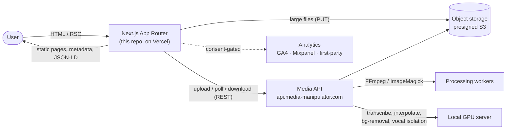
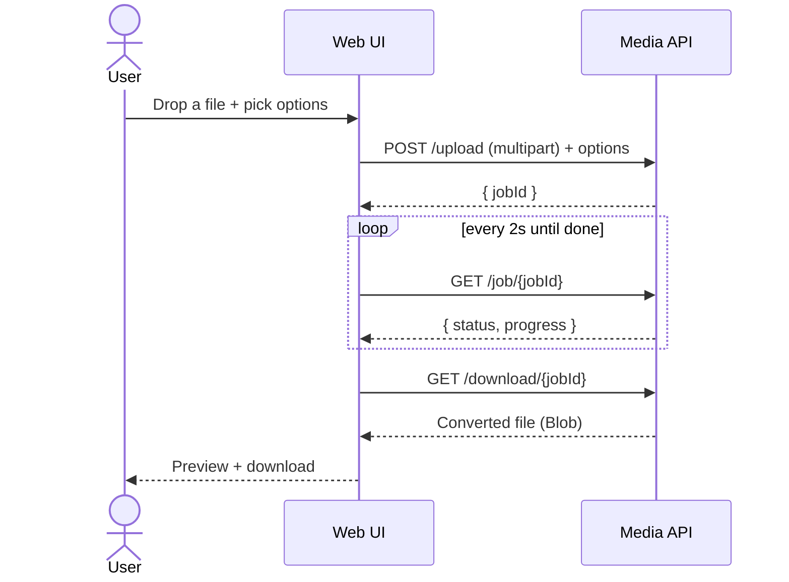
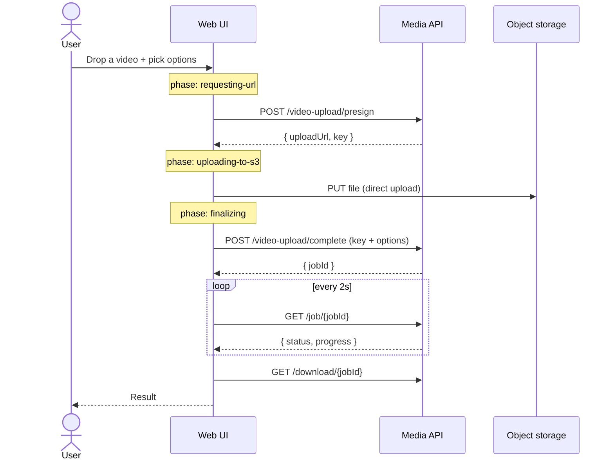
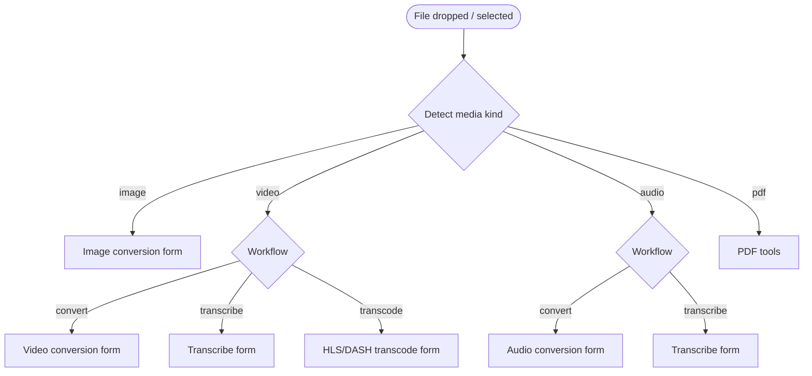
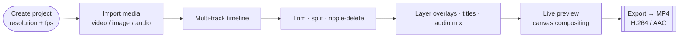

# Media Manipulator — Web UI

> The free, no‑signup web app for converting, compressing, editing, transcribing, and cleaning up **image, video, and audio** files — including **Content Studio**, a multi‑track video editor that runs right in your browser.

This repository is the **frontend** for [media-manipulator.com](https://www.media-manipulator.com): a [Next.js](https://nextjs.org/) (App Router) application that renders the marketing/SEO surface as static HTML and hosts the interactive conversion and editing tools as client‑side islands. Heavy media processing happens on a dedicated backend; this app orchestrates uploads, job polling, and downloads, and presents everything behind a fast, crawlable, ad‑safe UI.

---

## Table of contents

- [Highlights](#highlights)
- [Feature tour](#feature-tour)
- [Architecture](#architecture)
- [How a job flows](#how-a-job-flows)
- [Content Studio](#content-studio)
- [SEO & AdSense‑review safety](#seo--adsense-review-safety)
- [Project structure](#project-structure)
- [Getting started](#getting-started)
- [Environment variables](#environment-variables)
- [Scripts](#scripts)
- [Deployment](#deployment)
- [Internationalization](#internationalization)
- [Privacy & file handling](#privacy--file-handling)
- [Tech stack](#tech-stack)
- [License](#license)

---

## Highlights

- ⚡ **Next.js 16 App Router** — public pages are **server‑rendered/statically generated**, so titles, copy, FAQs, and JSON‑LD are present in view‑source for SEO. Interactive tools load as client‑only islands.
- 🎬 **Content Studio** — a Premiere‑style multi‑track timeline editor (video + image + audio layers → MP4 export), entirely in the browser.
- 🧰 **65 single‑purpose tools** across image, video, audio, AI, and privacy/metadata categories, each with a unique landing page.
- 🌍 **i18n‑ready** via `i18next` / `react-i18next` with feature‑sharded locale bundles.
- 🔒 **AdSense‑review‑safe by design** — ads are disabled by default, hard‑guarded to a single in‑content placement, and a CI‑style audit (`npm run audit:ads`) blocks regressions.
- 🎨 **Tailwind CSS v4** + **Radix UI** primitives, dark/light theming, and a custom “sci‑fi frame” visual language.

---

## Feature tour

| Category | Examples | Notes |
| --- | --- | --- |
| **Image** | Convert (JPG/PNG/WebP/AVIF/GIF/SVG/ICO), compress, resize, crop, remove background, image→PDF | Server‑side ImageMagick; AI background removal on a GPU server |
| **Video** | Convert (MP4/MOV/WebM/MKV/AVI…), compress, trim/cut, crop, rotate, →GIF, extract/remove audio, transcode to **HLS/DASH** | FFmpeg pipeline; large files use presigned S3 uploads |
| **Audio** | Convert (MP3/WAV/AAC…), waveform generator, isolate vocals | AI stem separation on a GPU server |
| **AI** | Transcribe video/audio, SRT generator, caption translator, AI frame interpolation | Models run on a local GPU server we operate |
| **AI Video Restoration** | Restore/upscale a ≤15s snippet with up to six models (Real‑ESRGAN, SwinIR, HAT, BasicVSR++, RVRT, VRT) and download one comparison package | `/tools/ai-video-restoration`; snippet selector + multi‑model pipeline on our GPU server |
| **Privacy** | Remove EXIF/GPS/IPTC/XMP metadata | Strips location & device data before sharing |
| **Content Studio** | Multi‑track editor → MP4 | See [Content Studio](#content-studio) |

Plus content sections: **Tutorials** (getting‑started guides + AI frame interpolation + Content Studio) and a **Blog** (compression, optimization, and audio‑quality guides).

---

## Architecture

The frontend is a thin, fast orchestration layer. It never does heavy media work itself — it requests uploads, tracks jobs, and serves results, while the backend API does the actual transcoding/AI.



**Rendering model**

- **Server Components** render all crawlable content (tool copy, FAQs, breadcrumbs, supported formats, JSON‑LD).
- **Client Components** (`"use client"`) power anything interactive: file inputs, drag‑and‑drop, the converter forms, and the Content Studio editor. Browser‑only/editor surfaces are loaded with `next/dynamic({ ssr: false })` so they never run during prerender — yet the SEO copy around them is always server‑rendered.
- **Metadata & structured data** come from the Next Metadata API (`lib/metadata.ts`) and server‑rendered JSON‑LD (`components/seo/json-ld.tsx`) — never mutated on the client.

---

## How a job flows

### Standard upload (images & smaller files)



### Large uploads (video) — presigned, resumable‑friendly



> The same upload→poll→download lifecycle powers **convert**, **transcribe**, and **transcode (HLS/DASH)** workflows — they differ only in the options payload and how the result is rendered (file download, transcript view, or streaming manifest).

### File‑type routing on the homepage



---

## Content Studio

Content Studio (`/tools/content-studio`) is the flagship tool: a browser‑based, multi‑track video editor.



- Frame‑accurate timeline; tracks composite in stacking order (higher tracks render over lower ones).
- State lives per project; recent projects reopen from the start screen.
- The editor is a client‑only island; the page still server‑renders a full guide + FAQ so it’s crawlable.

---

## SEO & AdSense‑review safety

This app is built to pass Google AdSense review cleanly:

- **Ads disabled by default.** No Google ad script loads unless `NEXT_PUBLIC_ADSENSE_ENABLED=true` **and** `NODE_ENV=production` **and** the page/placement/slot pass the guards in `lib/adsenseConfig.ts`.
- **One placement only.** During review the *only* eligible ad is a single **in‑content** unit on review‑allowlisted `/tools/<slug>` pages, placed after substantial copy and far from action buttons. No header/footer/sidebar/anchor/post‑conversion ads, no side rails, no sticky units.
- **No placeholders.** A real numeric slot (8–20 digits) is required; placeholder IDs can never reach `data-ad-slot`.
- **Mock ads** (`components/mock-ad.tsx`) are local‑preview‑only and never contact Google.
- **Review allowlist** (`content/reviewAllowlist.ts`) drives which tools are indexed, listed, sitemapped, and ad‑eligible. The homepage and review pages never link into non‑allowlisted tools.
- **`npm run audit:ads`** fails the build on any regression (placeholder leakage, global ad script, disallowed placements, macOS artifacts, or review pages linking to non‑allowlisted tools).
- **Review‑safe sitemap** (`app/sitemap.ts`) + crawler‑friendly `app/robots.ts`, with canonical origin `https://www.media-manipulator.com`.

---

## Project structure

```
.
├── app/                      # Next.js App Router (routes, layout, sitemap, robots)
│   ├── tools/                #   /tools, /tools/[slug], /tools/content-studio
│   ├── blog/  · tutorials/   #   content routes (server-rendered)
│   ├── layout.tsx            #   root layout, GA consent bootstrap, fonts
│   ├── providers.tsx         #   client providers + route analytics + shell
│   ├── sitemap.ts · robots.ts
│   └── globals.css           # Tailwind v4 + theme tokens + custom CSS
├── components/               # UI components
│   ├── content-studio/       #   the multi-track editor
│   ├── tools/                #   server-rendered tool landing page + panel island
│   ├── seo/                  #   JSON-LD renderer
│   ├── ui/                   #   Radix-based primitives
│   ├── ad-banner.tsx · mock-ad.tsx
│   └── top-nav.tsx · footer.tsx · ...
├── views/                    # Page-level client views (home, about, blog, tutorials…)
├── content/                  # toolPages.ts (tool data), reviewAllowlist.ts, keywordMap.ts
├── lib/                      # hooks + logic: upload/convert/transcode, firebase (lazy),
│                             #   analytics, adsenseConfig, adSlots, seo, metadata, studio…
├── i18n/                     # i18next setup + sharded en-US locale bundles
├── schemas/                  # zod schemas for conversion options
├── scripts/                  # audit-adsense.mjs, clean-appledouble.mjs
├── docs/                     # adsense review plan + slot inventory
└── public/                   # fonts, icons, ads.txt, og image
```

---

## Getting started

**Prerequisites:** Node.js ≥ 20 and npm.

```bash
# 1. Install dependencies
npm ci

# 2. Configure environment
cp .env.example .env.local   # then fill in values (see below)

# 3. Run the dev server
npm run dev                  # http://localhost:3000
```

> The app **builds and runs without Firebase credentials** — Firebase initializes lazily and only in the browser, so public pages prerender fine with blank `NEXT_PUBLIC_FB_*` values. Accounts/auth simply stay disabled until configured.

---

## Environment variables

All browser‑exposed variables use the `NEXT_PUBLIC_` prefix. See `.env.example` for the full template.

| Variable | Purpose | Default if unset |
| --- | --- | --- |
| `NEXT_PUBLIC_API_BASE_URL` | Media API base URL | `https://api.media-manipulator.com/api` |
| `NEXT_PUBLIC_ANALYTICS_BASE_URL` | First‑party analytics endpoint | `https://analytics.media-manipulator.com` |
| `NEXT_PUBLIC_GA_MEASUREMENT_ID` | GA4 measurement ID | `G-6J910CMHRY` |
| `NEXT_PUBLIC_MP_TOKEN` | Mixpanel token (consent‑gated) | — |
| `NEXT_PUBLIC_FB_*` | Firebase web config (auth/analytics) | — (auth disabled if blank) |
| `NEXT_PUBLIC_ADSENSE_ENABLED` | Enable real AdSense (prod only) | `false` |
| `NEXT_PUBLIC_MOCK_ADS_ENABLED` | Show first‑party mock ads (dev only) | `false` |

---

## Scripts

| Script | What it does |
| --- | --- |
| `npm run dev` | Start the Next dev server |
| `npm run build` | Production build (static generation) |
| `npm run start` | Serve the production build |
| `npm run lint` | ESLint |
| `npm run typecheck` | `tsc --noEmit` |
| `npm run audit:ads` | AdSense‑review safety audit (run after `build` for link checks) |
| `npm run clean:macos-artifacts` | Remove stray `.DS_Store` / `._*` files |

**Pre‑push checklist:** `npm run typecheck && npm run lint && npm run build && npm run audit:ads` — all should pass.

---

## Deployment

Deployed on **Vercel** (zero‑config Next.js). Set the `NEXT_PUBLIC_*` variables in the Vercel project settings; for the AdSense review keep `NEXT_PUBLIC_ADSENSE_ENABLED=false` and `NEXT_PUBLIC_MOCK_ADS_ENABLED=false`. `ads.txt`, the sitemap, and robots are served automatically.

---

## Internationalization

Translations live in `i18n/locales/<locale>/<namespace>/*.json`, sharded by feature (interface, forms, panels, pages, components, accessibility, error). `useLocalization()` wraps `react-i18next` and adds locale‑aware date/number/file‑size/duration formatters. Resources are bundled inline so server‑prerendered HTML contains real translated text (good for SEO). Add a language by dropping in new locale shards and registering it in `i18n/resources.ts`.

---

## Privacy & file handling

Uploads are processed on our own servers and are designed to be automatically deleted within 24 hours. AI features run on a GPU server we operate; files are not shared with third‑party AI providers. No account is required to use the tools. Analytics (GA4 / Mixpanel) are **consent‑gated** via Google Consent Mode v2.

---

## Tech stack


---

## License

This project is released under a **proprietary license** — see [LICENSE](./LICENSE). The source is published for demonstration and portfolio review; commercial use, redistribution, and hosting are not permitted without prior written permission.

**Author:** Mitchell Wintrow
**Email:** support@media-manipulator.com
**Website:** https://www.media-manipulator.com

---

<div align="center">

© 2026 Media Manipulator, a CreaTV Ltd. product. All rights reserved.

</div>
